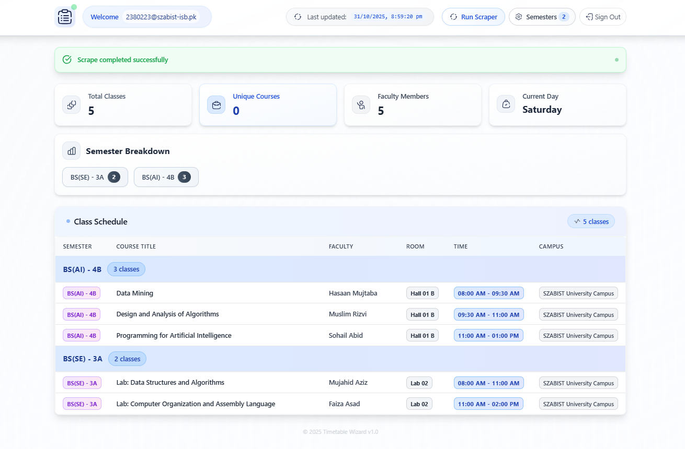

# Timetable Wizard

A full-stack web application that automates timetable extraction from Gmail for university students. Built specifically for SZABIST University's daily schedule email system.


## The Problem

SZABIST University sends class timetables via email every day. Students waste 10-15 minutes daily:
- Searching through email threads for the latest schedule
- Manually parsing complex HTML tables with inconsistent formatting  
- Dealing with different table structures (sometimes 6 columns, sometimes 9)
- Managing semester-specific course filtering manually

## The Solution
``
Timetable Wizard eliminates the manual work by:
- **Secure Gmail Integration**: OAuth-based authentication to access your emails safely
- **Intelligent Parsing**: Robust HTML table extraction that handles format inconsistencies
- **Clean Interface**: Modern React dashboard displaying schedules in organized tables
- **Multi-User Architecture**: Isolated user data with proper authentication flow
- **Smart Filtering**: Automatic semester detection and course relevance filtering

## Tech Stack & Architecture

**Backend (Python/Flask)**
- **Flask**: RESTful API with CORS support for cross-origin requests
- **Gmail API**: Official Google API integration with OAuth 2.0 authentication flow
- **BeautifulSoup + Pandas**: Robust HTML parsing and table data extraction
- **Supabase**: PostgreSQL database with real-time capabilities and user management
- **APScheduler**: Task scheduling system for automated operations
- **Rich**: Enhanced terminal logging and debugging interface

**Frontend (React/TypeScript)**
- **React 19**: Latest React with concurrent features and TypeScript integration
- **Tailwind CSS**: Utility-first styling for responsive design
- **Framer Motion**: Smooth animations and micro-interactions
- **Axios**: HTTP client with request/response interceptors
- **Context API**: Global state management for user authentication

**Infrastructure & Security**
- **OAuth 2.0**: Secure Gmail authentication without storing passwords
- **Multi-tenant Database**: User data isolation with encrypted token storage
- **Environment Configuration**: Flexible deployment with Docker support
- **Error Handling**: Comprehensive logging and graceful failure recovery

## Key Features & Challenges Solved

**Smart Email Processing**
- Connects to Gmail using secure OAuth flow (no password storage)
- Searches through email threads using intelligent keyword matching
- Extracts HTML content from complex multipart email structures

**Bulletproof Table Parsing**
- Handles inconsistent timetable formats (6-column vs 9-column layouts)
- Normalizes semester naming conventions: "BS(CS)-5C", "BS (AI) - 3A", etc.
- Fixes common data issues like "12:00 AM - 02:00 PM" → "12:00 PM - 02:00 PM"
- Uses Pandas for robust data processing and validation

**User Experience**
- One-click Gmail authentication with automatic token refresh
- Real-time status updates during data processing
- Clean tabular display with sorting and filtering
- Responsive design that works on mobile and desktop
- Semester-based filtering to show only relevant courses

**Technical Architecture**
- Multi-user support with complete data isolation
- Scalable database design with proper indexing
- Health check endpoints for monitoring
- Comprehensive error handling and logging
- Modular codebase for easy maintenance and feature additions

## Quick Start

**Prerequisites**
- Python 3.8+ and Node.js 16+
- Gmail account with API access enabled
- Supabase account for database hosting
- Google Cloud Console project for OAuth credentials

**Installation & Setup**

1. **Clone Repository**
   ```bash
   git clone https://github.com/muneeb-anjum0/Timetable-Wizard.git
   cd Timetable-Wizard
   ```

2. **Backend Setup**
   ```bash
   cd backend
   pip install -r requirements.txt
   ```

3. **Environment Configuration**
   Create `.env` file in backend directory:
   ```env
   SUPABASE_URL=your_supabase_project_url
   SUPABASE_SERVICE_KEY=your_service_role_key
   ALLOWED_SEMESTERS=BS (SE) - 5C, BS (CS) - 7A
   ```

4. **Google OAuth Setup**
   - Create project in Google Cloud Console
   - Enable Gmail API
   - Create OAuth 2.0 credentials
   - Download `client_secret.json` to `backend/credentials/`

5. **Frontend Setup**
   ```bash
   cd frontend
   npm install
   npm start
   ```

6. **Run Backend**
   ```bash
   cd backend
   python app.py
   ```

The application will be available at `http://localhost:3000` with the API running on `http://localhost:5000`.

## Development Insights

**Challenges Overcome**
- **Inconsistent Email Formats**: Built a robust parser that handles multiple table structures
- **Authentication Flow**: Implemented secure OAuth without exposing sensitive credentials
- **Multi-User Architecture**: Designed from scratch with proper data isolation
- **Real-Time Updates**: Created responsive UI that provides feedback during processing

**Code Quality**
- TypeScript for type safety and better developer experience
- Comprehensive error handling and logging throughout the application
- Modular architecture with clear separation of concerns
- Environment-based configuration for different deployment scenarios

## Project Status

**Current State**: MVP complete and functional
- Core features implemented and tested
- Multi-user authentication working
- Gmail integration stable
- Responsive UI completed

**In Progress**: Final testing and optimization before public deployment

## Roadmap

**Phase 2 Features**
- Google Calendar integration for automatic schedule sync
- Mobile push notifications for schedule changes
- Advanced analytics dashboard with attendance tracking
- WhatsApp/SMS notifications
- Integration with university's official systems

---

**Built to solve real student problems** - transforming a daily 15-minute manual task into a seamless automated experience.