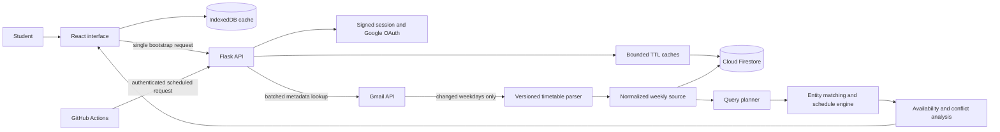

# ClassWire — SZABIST Timetable Search

> A multi-user, Gmail-integrated SZABIST timetable platform that extracts inconsistent schedule data, normalizes it, stores it cost-efficiently, and supports natural-language class and faculty-availability queries.

[](https://class-wire.vercel.app/)
[](https://github.com/muneeb-anjum0/ClassWire/actions/workflows/security.yml)
[](frontend/)
[](backend/)

**Live application:** [class-wire.vercel.app](https://class-wire.vercel.app/)

ClassWire turns SZABIST Islamabad timetable emails into structured schedules that students can query. Instead of manually scanning large, inconsistent tables, a user can ask:

- `Show BS(SE)-7A classes on Monday`
- `When are Zainab Iftikhar and Hamza Imran free?`
- `Show every 2-credit-hour theory course`
- `I am from BSSE7A, but I also want Software Construction and Software Quality Engineering`
- `Show the latest available timetable for the entire week`

The result is a normalized timetable, an availability answer, or a custom cross-section schedule—with conflicting classes identified automatically.

ClassWire is an independent student project and is not an official SZABIST service.

## Core capabilities

- natural-language search across sections, courses, course codes, faculty, weekdays, class types, and credit hours;
- latest-per-weekday timetable selection from Gmail rather than one fragile “latest email” assumption;
- computed faculty availability within university hours;
- custom schedules composed from a base section and courses offered to other sections;
- automatic overlap detection for custom schedules;
- per-user semester, subject, and faculty discovery filters;
- persistent restoration of the last successful timetable or search;
- optional daily timetable delivery;
- responsive light and dark interfaces designed separately for desktop and mobile information density.

## Contents

- [Engineering outcomes](#engineering-outcomes)
- [System architecture](#system-architecture)
- [Timetable ingestion and parser intelligence](#timetable-ingestion-and-parser-intelligence)
- [Incremental Gmail synchronization](#incremental-gmail-synchronization)
- [Natural-language schedule intelligence](#natural-language-schedule-intelligence)
- [Storage and database optimization](#storage-and-database-optimization)
- [Startup and runtime performance](#startup-and-runtime-performance)
- [Interface and experience](#interface-and-experience)
- [Security and privacy engineering](#security-and-privacy-engineering)
- [Reliability and background work](#reliability-and-background-work)
- [Observability without paid monitoring](#observability-without-paid-monitoring)
- [Verification strategy](#verification-strategy)
- [Technology choices](#technology-choices)
- [Current boundaries](#current-boundaries)

---

## Engineering outcomes

The project began as a timetable scraper and evolved into a complete schedule-intelligence system. The current architecture focuses on four properties: low latency, low infrastructure cost, resilient parsing, and a clean search experience.

| Area | Engineering outcome |
| --- | --- |
| Startup | Backend application import measured at approximately **0.19 seconds** |
| Browser startup | Authentication, configuration, and saved timetable consolidated into **one bootstrap request** |
| Gmail refresh | Unchanged weekdays are reused; only changed timetable emails are downloaded and parsed |
| Browser persistence | Large timetable results use IndexedDB through one reused connection, with synchronous storage retained only as a compatibility fallback |
| Large result rendering | Initial DOM work is bounded to **60 schedule rows** and progressively expanded |
| Parser benchmark | **100% row precision, row recall, and field accuracy** on the current checked-in labeled corpus |
| Search benchmark | A 40-query pass over **1,200 synthetic rows averaged 10.24 ms/query**; a repeated-result cache lookup averaged **0.001 ms** locally |
| Automated verification | **183 backend tests** and **21 frontend tests** passing at the time of this optimization release |
| Local health load test | **100/100 successful requests**, approximately **718 requests/second**, **25.5 ms average**, and **38.9 ms p95** at concurrency 20 |
| Production payload | Initial JavaScript reduced from **300.9 kB / 96.7 kB gzip** to **203.9 kB / 65.0 kB gzip**; authenticated CSS is **27.6 kB / 6.4 kB gzip** and route styles load on demand |

The search, cache, import, build, and load figures were measured locally. They are repeatable engineering baselines, not claims about public-network latency, Google APIs, Firestore, or Render cold starts.

### Optimization ledger

This table condenses the major changes into the problem each one addressed and the practical effect it produced.

| Original constraint | Optimization implemented | Practical effect |
| --- | --- | --- |
| Backend imported Firebase, scraper, and Gmail dependencies eagerly | Moved heavy integrations behind lazy request-time boundaries | Application import reduced to approximately 0.19 seconds on the measured machine |
| Health checks could wake external dependencies | Made health a constant-time Flask-only route | Render can mark the web process ready without waiting for Firestore or Gmail |
| Production performed a health probe before useful API work | Selected the known production API immediately and allowed the real request to wake it | Removed one blocking browser/network round trip |
| DNS and TLS setup began late | Added backend DNS prefetch, preconnect, and an early non-blocking wake request | Render wake-up starts while the static page is loading |
| Dashboard startup needed separate session, config, and timetable calls | Added one authenticated bootstrap contract | Fewer HTTP round trips and a consistent initial state |
| Bootstrap could still perform separate Firestore calls | Read settings and timetable through one `get_all` RPC | One database network exchange on a cold process cache |
| Large timetable JSON lived in synchronous `localStorage` | Introduced IndexedDB persistence, legacy migration, and connection reuse | Startup storage work no longer blocks the main thread and repeated operations avoid reopening the database |
| Returning to an open tab could lose useful context during refresh | Preserved successful React state and protected it from failed background requests | The last result stays visible across long-lived sessions and transient failures |
| Hundreds of rows rendered twice for desktop/mobile layouts | Added progressive 60-row render windows | Bounded reconciliation and layout work for broad searches |
| Every weekly refresh fetched every weekday email | Batched latest-message discovery and compared weekday message IDs | Only changed weekday messages are downloaded and parsed |
| Short Gmail age windows could omit a still-valid weekday | Used independent, unbounded latest-per-weekday queries | A new Monday can coexist with the latest available Tuesday from an older date |
| Partial Gmail batch failure could silently produce an incomplete schedule | Retried failed parts and rejected unresolved batches | Availability answers are not built from silently missing weekdays |
| Transient Gmail throttling caused immediate failures | Added timeout control and bounded exponential backoff with jitter | Better recovery from `429` and temporary `5xx` responses |
| Repeated searches could repeatedly reach Gmail | Separated the reusable weekly source from the latest displayed search | Normal searches execute against cached normalized data |
| Repeating an identical query still reran entity extraction and matching | Added a bounded, parser-versioned per-source result cache | Warm repeated queries reuse a deterministic answer in approximately 0.001 ms locally |
| Every search synchronously rewrote a large Firestore result | Persisted only normalized timetable sources while retaining answers in per-user IndexedDB | Removed a database round trip and billed write from ordinary searches |
| A stale-source fallback read the same Firestore document twice | Cached valid decoded sources before applying the freshness boundary | A stale fallback requires one document read instead of two |
| Repeated Firestore reads increased latency and operation count | Added bounded token, settings, timetable, source, identity, and health TTL caches | Warm requests avoid unnecessary database reads |
| Identical results created redundant Firestore writes | Added stable content hashes with volatile timestamp exclusion | Unchanged timetable and source documents are not rewritten |
| Large repeated JSON structures consumed document space | Stored compact JSON as gzip-compressed byte payloads | Lower stored payload size and network transfer from Firestore |
| Firestore document size failure could occur too late | Enforced a safe compressed-payload ceiling | Oversized data is rejected before an unsafe write |
| Parser assumed stable table columns | Added header-aware semantic column mapping | Reordered timetable formats continue to parse correctly |
| Empty HTML cells shifted subsequent values | Preserved cell positions and filled absent faculty as `TBD` | Room, time, campus, and faculty fields remain aligned |
| Plain-text and malformed emails were unsupported | Added guarded row-block fallback parsing | Non-table bulletins can still produce normalized classes |
| Headers, addresses, and footers appeared as phantom classes | Enforced course, section, and time invariants | Noise is rejected before persistence and search |
| Duplicate timetable rows inflated counts | Added stable multi-field row identities | Exact duplicate classes collapse into one result |
| Parser quality was anecdotal | Added versioned diagnostics and a labeled benchmark | Precision, recall, field accuracy, and rejection reasons are measurable |
| One-credit theory, labs, and FYP entries were conflated | Interpreted both components of `(theory, practical)` credits | `(1,0)`, `(0,1)`, and `(0,3)` produce different class semantics |
| Natural-language matching was difficult to debug | Returned an explicit query plan with recognized entities and combination mode | Search decisions are inspectable and testable |
| Section plus extra-course questions behaved like strict filters | Added additive-language detection and union execution | Custom cross-section schedules match real registration planning |
| Custom schedules could contain hidden collisions | Added interval-based conflict detection | Overlapping classes are surfaced with exact courses, sections, and overlap time |
| Multi-faculty questions could collapse to one person | Preserved canonical matches for every requested faculty member | Availability is calculated and displayed separately for each person |
| Rapid searches and restores could overwrite newer state | Added request sequence ordering and synchronous in-flight guards | Older asynchronous responses cannot replace a newer answer |
| A stale frontend parser constant invalidated current version-13 answers | Synchronized browser restoration with parser version 13 | Valid saved searches restore without an unnecessary API rerun |
| Concurrent refreshes duplicated Gmail work | Added per-user refresh locks with guarded lock creation | Simultaneous requests share one refreshed source |
| First concurrent Firestore access could race initialization | Added double-checked locking to the lazy store | Only one Firestore client is constructed per process |
| Errors and latency were difficult to correlate | Added request IDs, `Server-Timing`, JSON logs, counters, averages, and p95 values | Production behavior is inspectable without a paid monitoring service |
| Health polling produced noisy logs | Counted health traffic but excluded routine successes from structured logs | Useful metrics without excessive log volume |
| Daily delivery depended on a web-process daemon thread | Added a scheduled workflow and synchronous authenticated completion mode | Free, observable scheduling with a definitive success/failure result |
| Account removal did not cover all retained state | Added token revocation, batched document deletion, cache eviction, session clearing, and IndexedDB cleanup | Explicit end-to-end deletion workflow |
| Semester labels varied in size and color behavior | Added compact equal-geometry badges with stable color assignment | Consistent, low-noise scanning across desktop and mobile |
| Mobile cards repeated metadata and consumed excessive height | Reworked cards into a compact column-oriented information hierarchy | More classes fit on screen without removing schedule details |
| Hover effects introduced excessive motion | Replaced them with restrained background feedback | Lower visual distraction and no hover-driven layout movement |
| Suggestions repeated too frequently | Added randomized generation backed by per-user suggestion history | “Try asking” prompts rotate without immediate repetition |
| Public pages had weak search-engine context | Added canonical metadata, structured data, crawler directives, and a sitemap | Clear SZABIST timetable relevance and a consistent indexed identity |
| The initial frontend shipped one large application bundle | Split login, legal, and authenticated dashboard routes and removed Axios/Tailwind runtime weight | Initial JavaScript gzip size fell by about 33%, with route code loaded only when needed |
| The API client depended on a general-purpose HTTP library | Replaced it with a typed native Fetch client preserving credentials, timeouts, errors, and wake feedback | Smaller dependency graph and browser bundle with the same API contract |
| Global CSS contained unused animations and utility rules | Removed dead effects and retained only active touch and reduced-motion behavior | Less CSS parsing and a smaller stylesheet without changing the interface |
| Changes could reach production without complete verification | Protected `main` with backend, frontend, build, audit, and repository-guard checks | Deployments originate from reviewed, passing commits |

---

## System architecture


```mermaid
flowchart LR
  U[Student] --> UI[React interface]
  UI --> IDB[(IndexedDB cache)]
  UI -->|single bootstrap request| API[Flask API]

  API --> AUTH[Signed session and Google OAuth]
  API --> MEM[Bounded TTL caches]
  MEM --> FS[(Cloud Firestore)]

  API -->|batched metadata lookup| GM[Gmail API]
  GM -->|changed weekdays only| PARSER[Versioned timetable parser]
  PARSER --> NORMAL[Normalized weekly source]
  NORMAL --> FS

  NORMAL --> PLAN[Query planner]
  PLAN --> SEARCH[Entity matching and schedule engine]
  SEARCH --> CONFLICT[Availability and conflict analysis]
  CONFLICT --> UI

  GH[GitHub Actions] -->|authenticated scheduled request| API
```

The browser never receives Gmail OAuth credentials and never connects directly to Firestore. Authentication, scraping, parsing, persistence, search interpretation, and automation all remain behind the Flask API.

### Request lifecycle

1. A cached identity lets the interface paint immediately while the signed server session is verified.
2. The bootstrap endpoint returns the verified user, configuration, latest timetable, and last-update timestamp together.
3. IndexedDB can restore the last successful result before a slow network refresh completes.
4. A search first checks the in-process weekly source cache, then the persisted Firestore source, and reaches Gmail only when necessary.
5. Gmail is queried independently for the newest available message for each weekday.
6. Message IDs are compared with the previously normalized source.
7. Only changed weekday messages are downloaded, decoded, parsed, normalized, and persisted.
8. The query planner extracts the requested day scope, sections, courses, faculty, credit hours, and class types.
9. Matching rows are sorted, analyzed for overlaps, and returned with a human-readable answer.

---

## Timetable ingestion and parser intelligence

University timetable emails are not stable data feeds. They may contain reordered columns, empty cells, multiple tables, merged headings, inconsistent section formats, plain-text layouts, malformed faculty fields, or duplicate rows. ClassWire handles this as a data-normalization problem rather than relying on one fragile selector.

### Structured parsing first

When an HTML table is present, the parser reads headers and maps fields by meaning instead of assuming a fixed column position. This allows columns such as `Teacher`, `Faculty Name`, `Venue`, `Location`, `Class Time`, and `Timing` to move without breaking extraction.

Structured parsing also preserves empty cells. An empty faculty column therefore becomes `TBD` rather than shifting the room, time, and campus into the wrong fields.

### Guarded heuristic fallback

If no usable table exists, the email is flattened into row-like text blocks and processed by a deterministic fallback parser. A candidate is accepted only when it satisfies minimum class invariants:

- recognizable course identity;
- recognizable section or semester identity;
- a valid time interval;
- sufficiently coherent row structure.

Slot headings, campus addresses, email footers, incomplete rows, and other fragments are rejected before they enter the searchable dataset.

### Canonical normalization

Accepted rows are normalized into a shared representation containing the fields required by search and presentation:

| Field group | Examples |
| --- | --- |
| Academic identity | semester, section, course code, course title |
| Schedule | weekday, start/end display time, room, campus |
| People | canonical faculty name |
| Classification | theory, lab, FYP, credit-hour components |
| Provenance | message ID, parser version, source timestamp |

Section variants such as `BSSE7A`, `BS (SE) - 7A`, and `BS(SE)-7A` resolve to a consistent searchable identity while retaining a readable display label.

### Credit-hour semantics

ClassWire interprets the timetable’s `(theory, practical)` notation explicitly:

| Notation | Meaning |
| --- | --- |
| `(3,0)`, `(2,0)`, `(1,0)` | Theory courses with the corresponding credit value |
| `(0,1)` | Laboratory course |
| `(0,3)` | Final-year project course |

This prevents one-credit theory courses, labs, and FYP entries from being incorrectly grouped together simply because one component contains the number `1` or `3`.

### Duplicate control and parser diagnostics

Rows are deduplicated by a stable identity assembled from section, course, faculty, room, time, and campus. Parser-only raw fields are removed before API responses and Firestore persistence, reducing both payload size and storage cost.

Every parsing pass records privacy-safe counters:

- candidate rows;
- accepted rows;
- exact duplicates;
- rows rejected for missing identity;
- rows rejected for missing time;
- rows excluded by configured filters;
- parser version.

No course name, faculty name, email body, or user query is placed in telemetry logs.

### Labeled accuracy benchmark

The repository includes an anonymized labeled parser corpus. The benchmark compares complete normalized row identities and individual fields, producing:

- row precision;
- row recall;
- field accuracy;
- rejection diagnostics;
- parser-version metadata.

At the time of this release, the checked-in corpus measures **1.0000 precision**, **1.0000 recall**, and **1.0000 field accuracy**. The ordinary parser test suite covers additional layouts and edge cases beyond the smaller benchmark corpus.

---

## Incremental Gmail synchronization

The largest avoidable cost in the original pipeline was repeatedly downloading and reparsing six timetable emails when only one weekday had changed. ClassWire now treats each weekday as an independently versioned source.

### Latest-by-weekday selection

Six independent Gmail searches are issued in one batch—one for each supported weekday. Each query is intentionally unbounded by a short age window. As a result:

- a newly published Monday timetable supersedes the previous Monday;
- the latest Tuesday remains available even if no newer Tuesday email exists;
- an older weekday is not discarded merely because another day was updated more recently.

This produces a weekly schedule composed from the newest available source for each day rather than incorrectly assuming that all six messages arrive together.

### Change detection

The normalized weekly source stores a message ID per weekday. During refresh:

1. Gmail returns the latest weekday message IDs.
2. ClassWire compares them with the previous source.
3. Matching weekdays reuse their normalized rows.
4. Changed weekdays alone are fetched in full and reparsed.
5. Removed or unavailable weekdays are not silently carried forward.

The response records `changed_days`, `reused_days`, and `fetched_messages`, making refresh behavior measurable.

### API resilience

Gmail operations include:

- batched list and message requests;
- explicit request timeouts;
- bounded exponential backoff with jitter for `429` and transient `5xx` responses;
- retry of only failed batch components;
- failure rather than silently returning an incomplete week;
- persisted refreshed access tokens;
- verification that the authorized Gmail identity matches the signed-in account.

When Gmail is temporarily unavailable, search can fall back to the last persisted weekly source and clearly marks the answer as stale.

---

## Natural-language schedule intelligence

The search system is deterministic, inspectable, and optimized for timetable language. It does not depend on a paid large-language-model request for each query.

### Entity recognition

The interpreter recognizes:

- weekdays, including `today`, `tomorrow`, and `yesterday`;
- semester and section variations;
- faculty names with optional titles such as Dr., Mr., Professor, or Sir;
- course names and course codes;
- theory, lab, and FYP intent;
- numeric and written credit-hour values;
- whole-week and broad-schedule requests;
- small spelling mistakes and compacted names.

Canonical faculty matching combines formatting-only variants while avoiding unsafe assumptions—for example, a short name is not automatically treated as the same person as a longer, different identity.

### Explicit query plans

Every search result includes an internal query plan that exposes:

- intent: schedule or faculty free time;
- selected day scope;
- intersection or union combination mode;
- recognized sections;
- recognized courses and codes;
- base-section and course-to-section selection bindings for custom schedules;
- course-local theory, lab, and FYP qualifiers in custom schedules;
- recognized faculty;
- class-type and credit-hour filters.

This makes incorrect behavior diagnosable instead of hiding it behind an opaque search response.

### Intersection and union semantics

Normal filters use intersection semantics: a request for a course in a particular section returns that course only within that section.

Additive language—such as `plus`, `also`, `along with`, `as well`, or `I am from ... but want to take ...`—creates a union plan. ClassWire then returns:

- the complete base-section timetable; plus
- explicitly requested courses from their respective sections.

That behavior supports real course-planning questions rather than only simple database filtering.

### Faculty availability

Faculty availability is calculated from normalized class intervals within university hours. Overlapping or adjacent occupied intervals are merged before free gaps are generated, preventing duplicated or fragmented availability slots.

Multi-faculty questions retain each recognized faculty member and return separate availability schedules rather than silently selecting one name.

### Conflict detection

Custom schedules are analyzed for time collisions. Each conflict contains:

- weekday;
- overlap interval;
- both course titles;
- both sections;
- both original class times.

The interface shows a low-noise warning when the generated schedule contains overlaps.

---

## Storage and database optimization

ClassWire uses Firestore as durable per-user storage and surrounds it with short-lived in-process caches. The design minimizes reads and writes without allowing one user’s data to leak into another user’s result.

### Firestore data model

| Collection | Document identity | Stored responsibility | Optimization strategy |
| --- | --- | --- | --- |
| `users` | User ID | Normalized account identity and timestamps | Written once on first sign-in; directly addressable afterward |
| `gmail_tokens` | User ID | Encrypted Google OAuth token payload | Five-minute memory cache; write only on authorization or refresh |
| `user_settings` | User ID | Filters, timezone, timetable day, and delivery preferences | Five-minute memory cache; writes only on explicit changes |
| `timetable_cache` | User ID | Gzip-compressed latest parsed timetable | 60-second memory cache and content-hash write deduplication |
| `timetable_source_cache` | User ID | Gzip-compressed normalized weekly source | 30-minute memory cache and content-hash write deduplication |

Interactive reads use document IDs and therefore do not require composite indexes. The only collection-style access is the bounded daily-delivery scan.

### Compressed document storage

Timetables contain many repeated keys and labels, making them highly compressible. ClassWire serializes source and result documents into compact JSON and stores their gzip-compressed bytes. A safe payload ceiling prevents writes that approach Firestore’s document limit.

### Content-aware write suppression

Before writing a parsed timetable or normalized source, a stable content hash is calculated. Matching hashes skip Firestore writes entirely.

Interactive search answers are intentionally not written to Firestore. They are cached in process for repeated-query speed and stored in the user’s IndexedDB for restoration, while the durable normalized source remains available for cross-process searches.

### Multi-layer caching

| Layer | Purpose |
| --- | --- |
| React state | Keeps the active result visible while the tab remains open |
| IndexedDB | Restores the last successful timetable or search asynchronously across visits through one reused connection |
| Query-result TTL cache | Reuses deterministic answers for repeated normalized queries against the same parser/source version |
| Service TTL caches | Avoid repeated token, setting, source, and timetable document reads |
| Firestore | Durable cross-device persistence for settings, parsed timetables, and normalized weekly sources |
| Gmail | Authoritative source reached only when the normalized weekly source must refresh |

Existing `localStorage` timetable entries are migrated into IndexedDB. If IndexedDB is unavailable, the cache gracefully falls back rather than breaking the application.

### Retention and deletion

Timetable and source documents receive an `expires_at` timestamp and are eligible for deletion after seven days. A cleanup path also removes stale cache documents independently of Firestore TTL.

The account-deletion workflow:

1. retrieves the user’s stored Google credential;
2. attempts to revoke the refresh or access token with Google;
3. deletes the user, token, settings, timetable, and source documents in one batch;
4. removes corresponding in-process caches;
5. clears the signed browser session and local IndexedDB result.

---

## Startup and runtime performance

### Lazy backend initialization

Heavy services are not initialized during module import. Firebase Admin, Firestore, scraper configuration, Gmail clients, and parser dependencies are loaded only when the relevant request needs them.

The lazy Firestore wrapper uses double-checked locking, so concurrent first requests cannot accidentally construct multiple clients.

### Lightweight health path

The health endpoint performs no Gmail or Firestore network work. Render can determine that the process is alive as soon as Flask is ready, and the frontend can wake the backend without triggering database initialization.

Routine health polling is counted but excluded from structured request logs, preventing liveness traffic from consuming log volume.

### Consolidated bootstrap

The initial authenticated dashboard previously required separate session, configuration, and timetable requests. The bootstrap endpoint combines all three responsibilities.

On a cold Firestore cache, settings and timetable documents are fetched through one `get_all` RPC. On a warm process, both can be served from memory without a Firestore read.

### Browser wake-up strategy

The production client knows the authoritative backend origin and does not block the first useful request behind a redundant health probe. DNS prefetching, preconnection, and an early lightweight wake request begin while the page shell loads.

Local development retains backend autodetection and retry behavior without adding that production round trip.

### Render runtime tuning

Gunicorn explicitly binds every interface to Render's assigned `PORT`, preventing successful builds from timing out during the platform's port scan. The same rule lives in both the process command and Gunicorn's automatically discovered configuration, so a dashboard command as minimal as `gunicorn app:app` remains safe. Startup and crash output is streamed into deployment logs, while threaded request handling and shared-memory worker temporary files support concurrent lightweight requests without unnecessarily multiplying expensive clients.

### Bounded UI work

Large queries can return hundreds of classes. Rendering every desktop and mobile representation at once creates avoidable layout and reconciliation work. ClassWire initially renders 60 rows and expands in 60-row windows while clearly showing the visible and total counts.

The active result is never discarded merely because a background refresh fails. A user who returns to an open tab hours later continues to see the last successful timetable.

### Compressed API delivery

Large JSON responses are gzip-compressed when the browser advertises support and compression produces a smaller payload. Small responses avoid the compression overhead. API responses use explicit no-store browser semantics because authenticated timetable data should be restored through the controlled per-user cache rather than a shared HTTP cache.

---

## Interface and experience

The interface was redesigned around a compact conversational search workflow rather than a conventional filter-heavy dashboard.

### Search composer

- centered empty state that transitions into a compact result workspace;
- recent searches stored per user;
- context-aware randomized suggestions;
- suggestion-history rotation to avoid immediate repetition;
- removable individual recent searches and a clear-all action;
- dismissible results that can be restored;
- a clear control that resets the result and returns the composer to its centered state;
- loading, stale-source, success, warning, and error feedback without leaving an old answer under a new query.

### Timetable presentation

- search summary and timetable aligned to the same content grid;
- redundant class counts removed from nested mobile headings;
- stable, compact semester badges with deterministic colors;
- equal badge geometry for short and long semester names;
- restrained row hover treatment without large motion or layout shifts;
- consistent pluralization and day summaries;
- custom-schedule conflict notice;
- responsive desktop rows and compact mobile cards.

### Mobile layout

Mobile schedule cards prioritize course identity, then present time, faculty, and campus in a compact column-oriented information grid. Room badges remain visually separate and scannable. Spacing, type sizes, and metadata density are reduced without removing information.

### Accessibility and motion

Interactive controls have explicit labels, menus use menu roles, status messages expose appropriate live semantics, and keyboard dismissal is supported. Animations are small and functional; motion-heavy row effects were removed.

### Typography and themes

The application uses the Manrope variable font throughout, with a shared visual language across light and dark modes. Color is used as a quiet categorization aid rather than decoration.

### Search discoverability

The public shell includes SZABIST-focused page titles and descriptions, a canonical production URL, Open Graph metadata, structured application data, a sitemap, and crawler directives. The content clearly identifies ClassWire as an independent timetable utility while making its purpose understandable to search engines before authentication.

---

## Security and privacy engineering

Security controls are built into the data flow rather than added only at the UI boundary.

- Gmail permission is read-only.
- OAuth tokens are encrypted before Firestore persistence.
- Tokens are never returned to the browser.
- Sessions use signed, HTTP-only cookies with production-only secure behavior.
- OAuth state and PKCE verifier data are validated during callback handling.
- The authenticated Gmail identity is checked against the signed-in account.
- State-changing requests reject untrusted browser origins.
- CORS is limited to configured frontend origins.
- Expensive search and refresh operations use bounded per-user token-bucket limits.
- Simultaneous refreshes for one user collapse behind a per-user lock.
- Security headers restrict framing, MIME sniffing, referrer leakage, device permissions, and content sources.
- Production startup rejects missing or obviously weak secrets.
- Repository guards reject credential files, private keys, tokens, and common secret patterns.
- Dependency audits and tests run on protected pull requests.
- Account deletion removes retained application data and attempts Google token revocation.

Error messages are deliberately useful without exposing stack traces, OAuth material, message contents, or another account’s identity.

---

## Reliability and background work

### Stale-data resilience

The last normalized source and last presented result serve different purposes. If Gmail refresh fails, the source can remain usable for search while the UI clearly reports that it is using saved data. A failed refresh does not erase a previously valid timetable.

### Race prevention

- one refresh lock per user prevents duplicate Gmail work;
- synchronous request sequence numbers prevent an older response from overwriting a newer search;
- a synchronous in-flight search guard blocks rapid duplicate submissions;
- thread-safe lazy initialization protects shared backend clients;
- cached results are scoped by normalized user email.

### Background delivery without a paid worker

Daily timetable delivery uses a scheduled GitHub Actions workflow and an authenticated synchronous automation endpoint. The scheduler waits for a definitive completion response instead of relying entirely on an untracked daemon thread inside a web request.

Concurrency control prevents overlapping scheduled runs, and transient network failures are retried by the workflow.

---

## Observability without paid monitoring

ClassWire includes lightweight, dependency-free telemetry designed for a small deployment.

### Request tracing

Every API response receives:

- an `X-Request-ID` suitable for correlating failures;
- a `Server-Timing` duration visible in browser developer tools.

Non-health API requests produce structured JSON logs containing the route template, method, status, duration, request ID, and response size. User queries and timetable contents are excluded.

### Runtime measurements

The in-process metric registry tracks:

- response count by route and status;
- average and p95 route latency;
- parser latency and accepted/rejected rows;
- search interpretation and matching latency;
- matched-row volume;
- Gmail messages fetched;
- search-source tier: memory, Firestore, Gmail, or stale fallback;
- Firestore reads, writes, and account-document deletions;
- token, settings, timetable, source, and repeated-query cache hits.

A secret-protected metrics route exposes snapshots for diagnostics. Counters intentionally reset when a Render process restarts; the design avoids external monitoring charges while still making live behavior inspectable.

### Cost visibility

Instead of attempting to infer a cloud invoice, ClassWire counts the database and Gmail operations it controls. The dominant optimization is architectural:

- normal searches use cached normalized rows and require no Gmail read;
- repeated document reads are absorbed by TTL caches;
- ordinary searches create no Firestore write;
- unchanged timetable and source writes are suppressed by hashes;
- only changed weekday emails are fetched;
- browser restoration uses IndexedDB and requires no server response to paint the last result;
- one bootstrap request replaces several browser/API round trips.

These counters make it possible to estimate cost from actual usage without embedding provider-specific pricing into application logic.

---

## Verification strategy

ClassWire’s tests concentrate on failure modes that previously produced incorrect schedules, not only happy-path rendering.

### Backend coverage

The backend suite covers:

- reordered and missing timetable columns;
- multiple tables and nested rows;
- malformed, incomplete, and duplicate entries;
- Social Sciences and nonstandard semester formats;
- credit-hour, lab, theory, and FYP interpretation;
- typo-tolerant faculty and course matching;
- multi-faculty availability;
- additive custom schedules and intersections;
- explicit course-to-section binding without unrelated-section leakage;
- a 40-query adversarial acceptance matrix covering aliases, misspellings, relative days, credit semantics, repeated course families, ambiguous faculty names, multi-section customization, and overlap conflicts;
- conflict detection and query plans;
- latest-per-weekday Gmail selection;
- incremental reuse of unchanged weekdays;
- stale-source fallback;
- cache compression and content hashing;
- authentication, origin controls, rate limiting, bootstrap, telemetry headers, and account deletion.

### Frontend coverage

The frontend suite covers:

- conversational result presentation;
- recent and suggested search behavior;
- preservation of cached results during failed refreshes;
- protection against stale responses overwriting new searches;
- Social Sciences grouping;
- lab-title presentation;
- native Fetch credentials, JSON serialization, and API-error behavior;
- bounded 60-row rendering and progressive expansion.

### Continuous integration

The protected `main` branch requires the checked-in quality workflow. It performs backend tests, frontend tests, a production TypeScript/Vite build, dependency auditing, and repository secret scanning before changes can merge.

---

## Search and data-flow examples

### Standard section lookup

```text
Question
  "BSSE7A timetable on Monday"

Plan
  intent: schedule
  days: Monday
  sections: BS(SE)-7A
  combination: intersection

Result
  Only Monday rows belonging to BS(SE)-7A
```

### Custom cross-section timetable

```text
Question
  "I am from BSSE7A, but I also want Software Construction and
   Software Quality Engineering"

Plan
  base schedule: BS(SE)-7A
  additions: both named courses from every matching section
  combination: union

Result
  Base timetable + requested courses + detected time conflicts
```

### Faculty availability

```text
Question
  "When are Zainab Iftikhar and Hamza Imran free on Monday?"

Plan
  intent: free_time
  days: Monday
  faculty: both recognized identities

Result
  Separate merged availability windows and supporting classes for each faculty member
```

---

## Technology choices

| Layer | Technology | Why it fits ClassWire |
| --- | --- | --- |
| Client | React 19, TypeScript, Vite | Fast static delivery, typed state, and lightweight component testing |
| HTTP transport | Native Fetch API | Credentialed JSON requests, timeouts, and typed errors without a general-purpose client dependency |
| Browser storage | IndexedDB | Asynchronous persistence for large timetable payloads |
| API | Flask, Gunicorn | Small cold-start surface and straightforward authenticated routes |
| Database | Cloud Firestore | Simple per-user documents and inexpensive direct document access |
| Email source | Gmail API, Google OAuth 2.0 | Read-only access to the user’s authoritative timetable messages |
| Parsing | Beautiful Soup, lxml, deterministic heuristics | Handles both structured tables and malformed HTML/text without per-query AI cost |
| Testing | Pytest, Vitest, Testing Library | Fast backend, search, parser, hook, and component verification |
| Automation | GitHub Actions | Scheduled delivery and CI without a paid background-worker service |
| Hosting | Vercel and Render | Static frontend delivery with an independently deployable Python API |

---

## Repository map

```text
ClassWire/
├── backend/
│   ├── core/                 Authentication, caching, limits, telemetry, app setup
│   ├── database/             Encrypted tokens and optimized Firestore persistence
│   ├── routes/               User, search, config, automation, and lifecycle APIs
│   ├── scraper/              Gmail synchronization, parsing, normalization, search
│   ├── scripts/              Parser benchmarking and concurrency measurement
│   └── tests/                Backend, parser, search, security, and storage tests
├── frontend/
│   └── src/
│       ├── components/       Timetable, login, status, and shared UI
│       ├── context/          Authenticated bootstrap and account lifecycle
│       ├── features/         Dashboard and conversational search experience
│       ├── services/         API client and IndexedDB persistence
│       └── __tests__/        Hooks, search, grouping, and rendering tests
├── .github/workflows/        Protected quality checks and scheduled delivery
├── tools/                    Repository security guard
└── README.md                 Engineering case study and project documentation
```

---

## Current boundaries

ClassWire is heavily optimized for its current workload, but its measurements are intentionally presented with context:

- Render free-tier cold-start delay is controlled by the hosting platform; ClassWire minimizes application startup work but cannot eliminate platform suspension.
- In-process telemetry resets when a process restarts and is not a replacement for durable production tracing.
- The labeled parser benchmark is accurate for its current corpus, but the corpus should continue growing as genuinely different anonymized timetable formats appear.
- Progressive row windowing substantially limits DOM work; true viewport virtualization could provide another improvement for schedules containing thousands of visible rows.
- Local health-route throughput does not represent authenticated Gmail, Firestore, or public-network performance.

These are explicit engineering boundaries rather than hidden assumptions.

## License

No license is currently provided. All rights are reserved unless a license is added to the repository.
