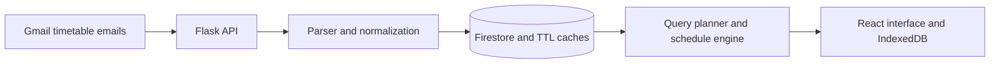

# ClassWire

> A multi-user, Gmail-integrated SZABIST schedule intelligence platform that extracts inconsistent timetable data, normalizes it, stores it efficiently, and answers natural-language schedule and faculty-availability questions.

[](https://class-wire.vercel.app/)
[](#project-status)
[](https://github.com/muneeb-anjum0/ClassWire/actions/workflows/security.yml)
[](LICENSE)

**Live:** [class-wire.vercel.app](https://class-wire.vercel.app/)

ClassWire converts SZABIST Islamabad timetable emails into searchable schedules. It supports section timetables, faculty availability, course and credit filters, cross-section schedule planning, and automatic clash detection without relying on a paid language-model request for every search.

ClassWire is an independent student project and is not an official SZABIST service.

## Project status

**Completed.** The planned product, search engine, data pipeline, responsive interface, security controls, performance work, and automated quality suite are implemented. The repository is now in maintenance mode for compatibility, timetable-format, security, and reliability updates.

## What ClassWire does

- Connects to the user's SZABIST Gmail account with read-only OAuth access.
- Selects the newest available timetable email independently for each weekday.
- Parses inconsistent HTML and plain-text timetable formats into normalized rows.
- Searches sections, courses, codes, faculty, weekdays, class types, and credit hours.
- Calculates faculty free time within university hours.
- Builds custom schedules from a base section and courses from other sections.
- Detects timetable clashes and groups conflicting classes visually.
- Restores the latest successful result from IndexedDB across visits.
- Supports optional scheduled daily timetable delivery.

Example questions:

```text
Show BSSE7A classes on Wednesday
When are Zainab Iftikhar and Hamza Imran free on Monday?
Show all 2-credit-hour theory courses
I am from BSSE7A; add Software Construction from BSSE5B
```

## Engineering snapshot

| Area | Result |
| --- | --- |
| Backend import | Approximately **0.19 seconds** on the measured development machine |
| Initial JavaScript | Reduced from **300.9 kB / 96.7 kB gzip** to **202.4 kB / 64.6 kB gzip** |
| Large-result rendering | Initial work limited to **60 schedule rows**, then expanded progressively |
| Automated checks | **174 backend tests + 50 frontend tests = 224 tests** |
| Measured coverage | **63.2% backend branch-aware coverage**, **67.9% frontend line coverage** |
| Search architecture | Deterministic, inspectable query plans with parser-versioned caching |
| Storage | Compressed Firestore documents, stable hashes, TTL caches, and write suppression |

Measurements are local engineering baselines. They do not represent public-network latency, Google API response time, Firestore latency, or Render free-tier cold starts.

## Architecture


```mermaid
flowchart LR
  Gmail[Gmail timetable emails] --> API[Flask API]
  API --> Parser[Parser and normalization]
  Parser --> Store[(Firestore and TTL caches)]
  Store --> Search[Query planner and schedule engine]
  Search --> UI[React interface and IndexedDB]
```

The browser never receives Gmail OAuth credentials and never connects directly to Firestore. Authentication, ingestion, parsing, persistence, search, availability calculation, and automation remain behind the API.

## Documentation

| Document | Contents |
| --- | --- |
| [Documentation index](docs/README.md) | Complete technical documentation map |
| [Architecture](docs/architecture/README.md) | Components, request lifecycle, security, and repository structure |
| [Data pipeline](docs/data-pipeline/README.md) | Gmail synchronization, parsing, normalization, Firestore, and retention |
| [Search engine](docs/search-engine/README.md) | Entity recognition, query plans, schedule composition, availability, and clashes |
| [Performance](docs/performance/README.md) | Startup, caching, rendering, payload, and database optimizations |
| [Interface](docs/interface/README.md) | Search experience, responsive timetable presentation, accessibility, and SEO |
| [Operations](docs/operations/README.md) | Deployment, telemetry, background delivery, reliability, and cost visibility |
| [Quality suite](docs/quality/README.md) | Test organization, coverage policy, commands, and CI guarantees |

## Technology

React 19, TypeScript, Vite, Flask, Gunicorn, Cloud Firestore, Gmail API, Google OAuth 2.0, Beautiful Soup, IndexedDB, Pytest, Vitest, GitHub Actions, Vercel, and Render.

## Restricted license

ClassWire is publicly viewable but **not open source**. No permission is granted to copy, reuse, modify, distribute, deploy, sell, sublicense, or create derivative works from its source code, interface, documentation, branding, or implementation without prior written authorization.

The product concept and workflows are also not offered for reuse. Applicable law may distinguish an abstract idea from its protected expression and implementation. The enforceable restrictions are defined in the [ClassWire Restricted Source License](LICENSE).

Copyright © 2026 Muneeb Anjum. All rights reserved.
