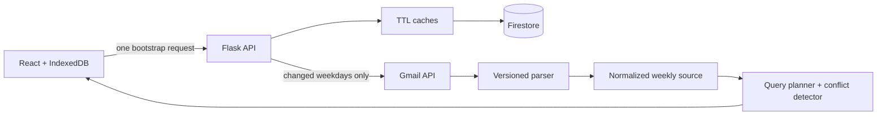

# ClassWire - SZABIST Timetable Search

ClassWire is a fast, searchable **SZABIST timetable and class-schedule app** for students. It connects to Gmail with read-only OAuth access, converts SZABIST timetable emails into structured schedules, and lets students search courses, sections, faculty availability, labs, and weekly classes using natural language.

**Live app:** [class-wire.vercel.app](https://class-wire.vercel.app/)

ClassWire is an independent student utility and is not an official SZABIST service.

## Features

- Natural-language SZABIST timetable search for sections, courses, faculty, weekdays, and course codes
- Faculty availability calculation across university hours
- Theory, lab, and final-year-project classification from credit-hour notation
- Header-aware HTML parsing with fallback heuristics for inconsistent email layouts
- Gmail OAuth with read-only access and encrypted token storage
- Per-user semester, subject, and faculty filters
- Persistent restoration of the latest timetable or search result
- Optional daily timetable delivery by email
- In-memory and compressed Firestore caching to reduce API calls, latency, and storage costs
- Incremental weekday refreshes that only download and parse changed Gmail messages
- Explicit natural-language query plans and timetable conflict detection
- IndexedDB browser persistence and bounded large-result rendering
- Dependency-free structured request telemetry with latency and cache metrics
- Responsive light and dark interfaces for desktop and mobile

## SZABIST timetable search

Students can search the weekly SZABIST class schedule with questions such as:

- `Show BS(SE)-7A classes on Monday`
- `When is Zainab Iftikhar free?`
- `Show all 3-credit-hour courses`
- `Find Software Quality Engineering and Testing classes for the entire week`

ClassWire understands common SZABIST section formats, course codes, theory and lab credit notation, multiple faculty members, and timetable data from the Islamabad campus email format.

## Technology stack

| Layer | Technology |
| --- | --- |
| Frontend | React 19, TypeScript, Vite, Axios |
| Backend | Python, Flask, Gunicorn |
| Data | Cloud Firestore |
| Integrations | Gmail API, Google OAuth 2.0, SMTP |
| Parsing | Beautiful Soup, lxml, deterministic parsing heuristics |
| Testing | Pytest, Vitest, Testing Library |

## Architecture

The React client communicates exclusively with the Flask API. The backend owns authentication, Gmail access, SZABIST timetable parsing, search, caching, Firestore persistence, and optional email delivery. Browser clients never receive Gmail credentials or connect directly to Firestore.

Timetable retrieval follows this path:


```mermaid
flowchart LR
  Browser[React + IndexedDB] -->|one bootstrap request| API[Flask API]
  API --> Memory[TTL caches]
  Memory --> Firestore[(Firestore)]
  API -->|changed weekdays only| Gmail[Gmail API]
  Gmail --> Parser[Versioned parser]
  Parser --> Source[Normalized weekly source]
  Source --> Search[Query planner + conflict detector]
  Search --> Browser
```

1. The user signs in through Google OAuth with Gmail read-only permission.
2. The backend locates the newest timetable email for each weekday using batched Gmail requests.
3. Structured table parsing extracts canonical timetable rows; guarded heuristics handle nonstandard layouts.
4. Message IDs are compared per weekday; unchanged days reuse their last parsed rows.
5. Parsed source data is cached in memory and as compressed Firestore payloads.
6. The authenticated bootstrap endpoint returns identity, settings, and the last result in one request.
7. Natural-language queries run against the cached weekly source without repeatedly accessing Gmail.

### Firestore schema and retention

| Collection | Document ID | Contents | Read/write strategy |
| --- | --- | --- | --- |
| `users` | User ID | Account identity and timestamps | Read during session verification; one write on first sign-in |
| `gmail_tokens` | User ID | Encrypted OAuth credentials | Five-minute memory cache; updated only after OAuth or token refresh |
| `user_settings` | User ID | Filters, timezone, and delivery preferences | Five-minute memory cache; write only when preferences change |
| `timetable_cache` | User ID | Gzip-compressed latest result | Content-hash write deduplication and 60-second memory cache |
| `timetable_source_cache` | User ID | Gzip-compressed weekly source | Thirty-minute memory cache and content-hash write deduplication |

All lookups use document IDs, so no composite Firestore index is required for interactive requests. The optional daily-email scan uses a bounded collection scan; stale timetable documents carry `expires_at` timestamps and are also cleaned after seven days. Configure Firestore TTL on `expires_at` for automatic deletion. Account deletion revokes the Google token on a best-effort basis and removes all five user documents immediately.

### Observability and parser quality

Every API response includes `X-Request-ID` and `Server-Timing`. The backend logs structured JSON request events without query text or timetable content. A protected `GET /api/metrics` endpoint (header `X-Automation-Secret`) reports in-process counters plus average and p95 latency without a paid monitoring service.

Run the labeled parser benchmark with:

```bash
PYTHONPATH=backend backend/.venv/bin/python backend/scripts/benchmark_parser.py
```

The report includes row precision, row recall, field accuracy, rejection counts, and the parser version. Add anonymized cases to `backend/tests/fixtures/parser_benchmark.json` whenever a new email layout is encountered.

Run the local concurrency smoke test with:

```bash
backend/.venv/bin/python backend/scripts/load_test.py --requests 200 --concurrency 20
```

To measure the authenticated bootstrap path, pass `--url http://localhost:5001/api/bootstrap` and an exported development session cookie through `--cookie`. The tool reports throughput, average latency, p95 latency, failures, and maximum latency; it does not call a paid monitoring or billing service.

## Prerequisites

- Python 3.12 or newer
- Node.js 22 or newer
- A Firebase project with Cloud Firestore enabled
- Google OAuth web-application credentials with Gmail API access
- Optional SMTP credentials for daily email delivery

## Local installation

Clone the repository and install the backend:

```bash
git clone https://github.com/muneeb-anjum0/ClassWire.git
cd ClassWire

python -m venv backend/.venv
source backend/.venv/bin/activate
python -m pip install --upgrade pip
python -m pip install -r backend/requirements.txt
cp backend/.env.example backend/.env
```

On Windows PowerShell, activate the environment with:

```powershell
backend\.venv\Scripts\Activate.ps1
Copy-Item backend\.env.example backend\.env
```

Install the frontend:

```bash
cd frontend
npm ci
cp .env.example .env
cd ..
```

## Service configuration

### Firebase

Create a service account for a Firebase project with Cloud Firestore enabled. Configure either:

- `FIREBASE_SERVICE_ACCOUNT_JSON` with the complete service-account JSON, or
- `FIREBASE_SERVICE_ACCOUNT_PATH` with an absolute path to the JSON file.

Set `FIREBASE_PROJECT_ID` to the Firebase project ID. Required collections are created automatically as the application stores users, encrypted Gmail tokens, settings, and caches.

### Google OAuth

Create OAuth 2.0 credentials for a Web application and enable the Gmail API. For local development, configure:

- Authorized JavaScript origin: `http://localhost:5174`
- Authorized redirect URI: `http://localhost:5001/api/auth/gmail/callback`

Provide the OAuth client JSON through `CLIENT_SECRET_JSON`, or place it at `backend/credentials/client_secret.json`. Never commit the credential file.

### Environment variables

Use [`backend/.env.example`](backend/.env.example) and [`frontend/.env.example`](frontend/.env.example) as templates.

| Variable | Purpose |
| --- | --- |
| `FLASK_SECRET_KEY` | Signs server-side session cookies |
| `TOKEN_ENCRYPTION_KEY` | Encrypts Gmail OAuth credentials before persistence |
| `PUBLIC_BACKEND_URL` | Public backend origin used for OAuth callbacks |
| `FRONTEND_ORIGINS` | Comma-separated browser origins allowed by CORS |
| `FIREBASE_PROJECT_ID` | Firebase project identifier |
| `FIREBASE_SERVICE_ACCOUNT_JSON` | Inline Firebase service-account JSON |
| `CLIENT_SECRET_JSON` | Inline Google OAuth client JSON |
| `AUTOMATION_SECRET` | Protects scheduled automation endpoints |
| `GMAIL_QUERY_BASE` | Base Gmail query used to discover timetable messages |
| `GMAIL_API_TIMEOUT_SECONDS` | Timeout applied to Gmail API requests |
| `SMTP_*` | Optional SMTP delivery configuration |
| `VITE_API_URL` | Backend URL used by the React client |

Generate long, independent values for `FLASK_SECRET_KEY`, `TOKEN_ENCRYPTION_KEY`, and `AUTOMATION_SECRET` in production.

Daily delivery can run without a paid worker: the checked-in GitHub Actions schedule calls the synchronous automation endpoint and waits for a definitive result. Configure repository secrets `CLASSWIRE_BACKEND_URL` and `CLASSWIRE_AUTOMATION_SECRET`; the latter must match the backend's `AUTOMATION_SECRET`.

## Running locally

Start the backend from the repository root:

```bash
backend/.venv/bin/python backend/app.py
```

Start the frontend in another terminal:

```bash
cd frontend
npm run dev
```

Open `http://localhost:5174`. The Flask API runs at `http://localhost:5001`.

## Quality checks

Run the complete backend verification:

```bash
PYTHONPATH=backend backend/.venv/bin/python -m pytest backend/tests
backend/.venv/bin/python -m pip_audit --local
backend/.venv/bin/python tools/repository_guard.py
```

Run frontend tests, dependency auditing, and the production build:

```bash
cd frontend
npm test -- --run
npm audit --audit-level=high
npm run build
```

GitHub Actions runs the same security, backend, frontend, and build checks for pull requests and updates to `main`.

## Deployment

The backend is production-ready through the checked-in [`backend/Procfile`](backend/Procfile). Configure the deployment service to use `backend` as its root directory and provide all secrets through environment variables.

Build the frontend with:

```bash
cd frontend
npm ci
npm run build
```

Deploy `frontend/dist` to a static hosting provider and set `VITE_API_URL` to the public backend URL before building. Add the deployed frontend origin and backend OAuth callback URL to the Google OAuth client configuration.

## Security

- Gmail access is read-only.
- OAuth tokens are encrypted before being written to Firestore.
- Authentication uses signed, HTTP-only session cookies.
- State-changing browser requests are restricted by origin checks and CORS.
- Expensive endpoints use bounded per-user rate limiting.
- Repository checks reject tracked credentials, private keys, and common secret formats.
- `.env`, OAuth client files, Firebase service accounts, app passwords, and refresh tokens must never be committed.

## Repository layout

```text
ClassWire/
├── backend/          Flask API, Gmail integration, parser, search, and persistence
├── frontend/         React application and UI tests
├── tools/            Repository security checks
├── .github/          Continuous integration workflow
└── README.md         Project documentation
```

## License

No license is currently provided. All rights are reserved unless a license is added to the repository.
