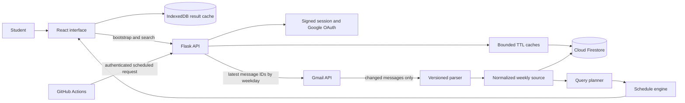

# Architecture

ClassWire separates the public interface, authenticated application API, source ingestion, normalized storage, and deterministic search engine. This keeps Google credentials and Firestore access on the server while allowing the React application to remain a fast static deployment.

## System map



## Component responsibilities

| Component | Responsibility |
| --- | --- |
| React client | Authentication flow, search composition, result presentation, browser persistence, and account controls |
| Flask API | Session enforcement, request contracts, rate limits, orchestration, telemetry, and lifecycle endpoints |
| Gmail integration | Read-only discovery and retrieval of the newest available timetable source for each weekday |
| Parser | Structured-table extraction, text fallback, validation, normalization, deduplication, and diagnostics |
| Firestore layer | Encrypted token storage, settings, compact timetable documents, normalized source persistence, and retention metadata |
| Search engine | Entity recognition, explicit query planning, row matching, availability calculation, and clash detection |
| GitHub Actions | Quality gates and scheduled daily delivery without a dedicated paid worker |

## Request lifecycle

1. A cached identity allows the interface shell to paint while the signed server session is checked.
2. One bootstrap request returns the verified identity, latest timetable, and last-update timestamp.
3. IndexedDB can restore the last successful result before a slow refresh finishes.
4. Search checks the normalized source in memory, then Firestore, then Gmail only when refresh is required.
5. Gmail is queried independently for the newest available message for each weekday.
6. Message IDs determine which weekday sources can be reused and which must be fetched again.
7. Changed messages are decoded, parsed, normalized, deduplicated, and persisted.
8. The query planner records the requested days, sections, courses, codes, faculty, credit values, and class types.
9. The engine applies intersection or union semantics, calculates availability and conflicts, and returns a human-readable answer with exact rows.

## Trust boundaries

- The browser never receives Gmail refresh tokens or Firestore credentials.
- Gmail OAuth access is read-only.
- OAuth tokens are encrypted before persistence.
- Sessions use signed HTTP-only cookies with secure production behavior.
- OAuth state and PKCE verifier data are checked during callback handling.
- The authorized Gmail identity must match the signed-in account.
- State-changing requests reject untrusted browser origins.
- CORS is restricted to configured frontend origins.
- Search and refresh operations use bounded per-user rate limits.
- Production startup rejects missing or obviously weak secrets.
- Account deletion attempts Google token revocation and removes application data, caches, session state, and IndexedDB state.

## Concurrency and state safety

- A per-user refresh lock prevents duplicate Gmail work.
- Guarded lock construction prevents a race during the first request for a user.
- The lazy Firestore wrapper uses double-checked locking so one process creates one client.
- Frontend request sequence numbers prevent stale asynchronous responses from replacing newer results.
- A synchronous in-flight guard blocks rapid duplicate search submissions.
- Cache keys include normalized user identity to prevent cross-account state reuse.
- A failed refresh leaves the last valid result visible instead of clearing it.

## Repository structure

```text
ClassWire/
├── backend/
│   ├── core/                 Authentication, caching, limits, telemetry, app setup
│   ├── database/             Encrypted tokens and optimized Firestore persistence
│   ├── routes/               User, search, automation, and lifecycle APIs
│   ├── scraper/              Gmail synchronization, parsing, normalization, search
│   └── tests/                Unit, integration, acceptance, and fixtures
├── frontend/
│   └── src/
│       ├── components/       Timetable, login, status, and shared UI
│       ├── context/          Authenticated bootstrap and account lifecycle
│       ├── features/         Dashboard and conversational search experience
│       ├── services/         API client and IndexedDB persistence
│       └── tests/            UI behavior, hooks, API contracts, and rendering
├── docs/                     Focused technical documentation
├── .github/workflows/        CI, security, build, and scheduled delivery
└── tools/                    Repository security guard
```

## Technology choices

| Layer | Technology | Role |
| --- | --- | --- |
| Client | React 19, TypeScript, Vite | Typed static application and route-level code splitting |
| Transport | Native Fetch API | Credentialed requests, timeouts, typed failures, and no extra HTTP runtime |
| Browser persistence | IndexedDB | Asynchronous storage for large per-user results |
| API | Flask and Gunicorn | Compact authenticated web service with predictable startup |
| Database | Cloud Firestore | Direct per-user documents with simple durable storage |
| Source | Gmail API and Google OAuth 2.0 | Read-only access to authoritative timetable emails |
| Parsing | Beautiful Soup and deterministic heuristics | Structured and malformed timetable extraction without per-query AI cost |
| Verification | Pytest, Vitest, Testing Library | Unit, integration, acceptance, contract, and interface checks |
| Automation | GitHub Actions | CI and scheduled delivery without a paid job service |
| Hosting | Vercel and Render | Independently deployable static client and Python API |

[Back to documentation index](../README.md)
