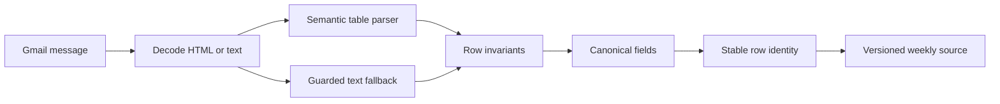

# Data Pipeline

The timetable source is an inbox, not a stable database. Messages can arrive on different dates, contain inconsistent tables, omit cells, rename columns, repeat rows, or fall back to plain text. ClassWire treats ingestion as a versioned normalization pipeline.

## Latest source per weekday

ClassWire issues independent Gmail searches for Monday through Saturday. Each query is intentionally not limited to a short age window.

This means:

- a new Monday supersedes the previous Monday;
- the latest Tuesday remains valid when no newer Tuesday exists;
- an older weekday is not discarded because another weekday changed recently;
- the weekly schedule is assembled from the newest available source for each day.

## Incremental synchronization

The normalized weekly source records the Gmail message ID used for each weekday. During refresh:

1. Gmail returns the newest message ID for every weekday.
2. Those IDs are compared with the stored source manifest.
3. Unchanged weekdays reuse their normalized rows.
4. Only changed weekday messages are downloaded and parsed.
5. Missing or failed batch components are retried once.
6. An unresolved partial batch fails explicitly instead of returning a silently incomplete week.

The response exposes changed days, reused days, and fetched-message counts so refresh behavior can be measured.

## Gmail resilience

- List and message calls are batched.
- Requests have explicit timeouts.
- `429` and temporary `5xx` responses use bounded exponential backoff with jitter.
- Only failed parts of a batch are retried.
- Refreshed access tokens are persisted.
- The authorized Gmail address is checked against the signed-in identity.
- A temporarily unavailable Gmail source can fall back to the last persisted normalized source with a stale-data warning.

## Parser stages

### Semantic table extraction

HTML tables are mapped by header meaning instead of fixed column index. Labels such as `Teacher`, `Faculty Name`, `Venue`, `Location`, `Class Time`, and `Timing` can move without shifting the result schema.

Empty table cells remain empty during extraction. A missing faculty value becomes `TBD`; it does not cause the room, time, or campus value to move into the wrong field.

### Guarded text fallback

When no usable table exists, the message is flattened into row-like blocks. A candidate row must contain:

- a recognizable course identity;
- a section or semester identity;
- a valid time interval;
- enough coherent fields to distinguish a class from surrounding text.

Campus addresses, slot headings, email footers, incomplete fragments, and unrelated notices are rejected before persistence.

## Canonical row model

| Field group | Representative values |
| --- | --- |
| Academic identity | semester key, display section, course code, course title |
| Schedule | weekday, time range, room, campus |
| People | canonical faculty display name |
| Classification | theory, lab, FYP, theory credits, practical credits |
| Provenance | Gmail message ID, parser version, source timestamp |

Section formats such as `BSSE7A`, `BS (SE) - 7A`, and `BS(SE)-7A` resolve to one searchable identity while preserving a readable label.

## Credit semantics

ClassWire interprets the timetable tuple as `(theory, practical)` rather than a single ambiguous number.

| Notation | Interpretation |
| --- | --- |
| `(3,0)`, `(2,0)`, `(1,0)` | Theory course with the stated theory credits |
| `(0,1)` | Laboratory course |
| `(0,3)` | Final-year project entry |

This prevents one-credit theory courses, labs, and FYP entries from being conflated.

## Deduplication and diagnostics

A stable row identity combines section, course, faculty, room, time, and campus. Exact duplicates collapse before storage and search.

Each parse records privacy-safe counters for candidate rows, accepted rows, duplicate rows, identity failures, time failures, parser duration, and parser version. Course names, faculty names, email bodies, and user queries are excluded from telemetry.

## Firestore model

| Collection | Document key | Stored responsibility | Optimization |
| --- | --- | --- | --- |
| `users` | User ID | Canonical identity and timestamps | Direct lookup and first-sign-in write |
| `gmail_tokens` | User ID | Encrypted Google credential | Five-minute memory cache and refresh-only writes |
| `user_settings` | User ID | Timezone and delivery preferences | Five-minute memory cache and explicit writes |
| `timetable_cache` | User ID | Compressed latest presented timetable | 60-second cache and content-hash deduplication |
| `timetable_source_cache` | User ID | Compressed normalized weekly source | 30-minute cache and content-hash deduplication |

Interactive paths use direct document IDs and require no composite Firestore indexes. The bounded daily-delivery scan is the only collection-style access pattern.

## Storage strategy

- Repeated timetable JSON is serialized compactly and stored as gzip-compressed bytes.
- A safe compressed-payload limit rejects oversized documents before Firestore does.
- Stable hashes exclude volatile timestamps and suppress identical writes.
- Ordinary searches do not write their answer to Firestore.
- Search results remain in React state, a bounded process cache, and the user's IndexedDB.
- The normalized weekly source remains durable for cross-process search and stale fallback.

## Retention and deletion

Timetable and normalized-source documents include an expiry timestamp for a seven-day Firestore TTL policy.

Permanent account deletion:

1. loads the stored Google credential;
2. attempts token revocation with Google;
3. deletes user, token, settings, timetable, and source documents as one batch;
4. evicts related process caches;
5. clears the signed session and browser IndexedDB state.

[Back to documentation index](../README.md)
